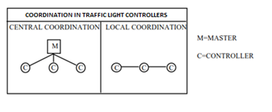
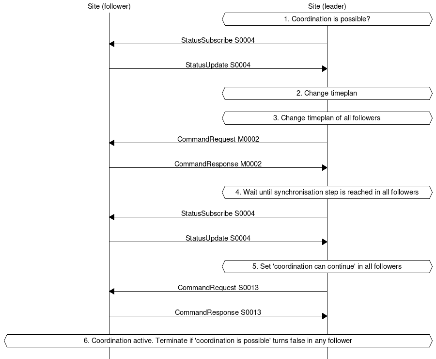
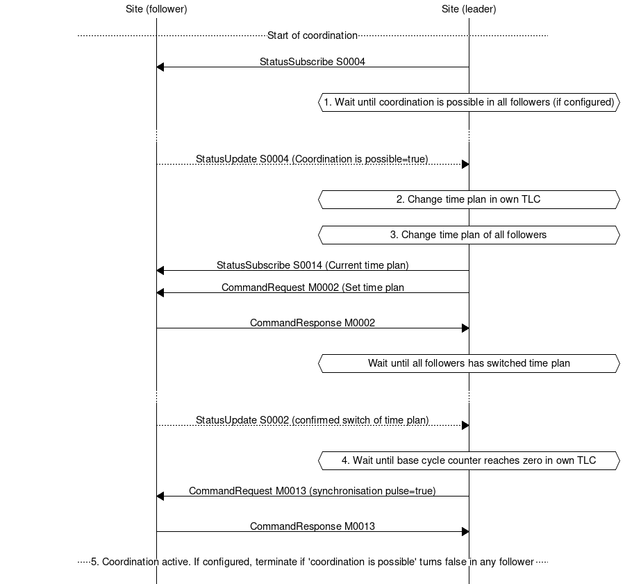
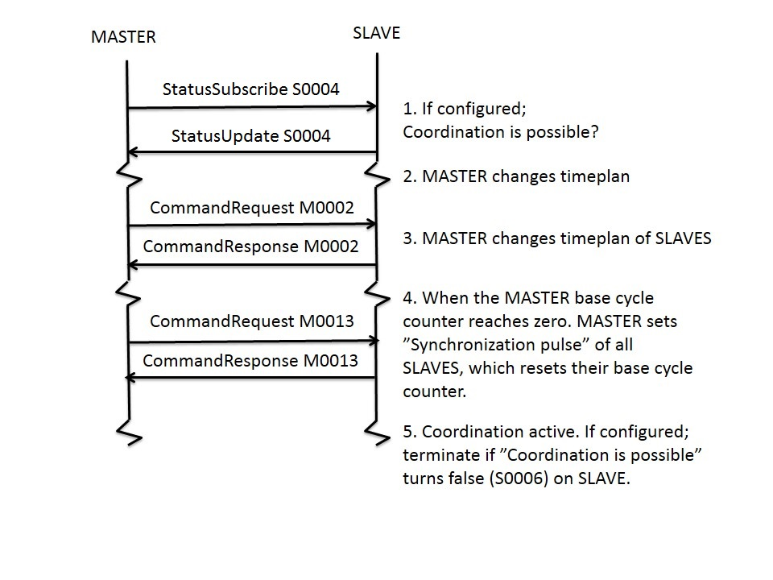

Appendix - coordination between traffic light controllers
=========================================================

General concepts
----------------
Coordination between Traffic Light Controllers (TLC) implies that several
intersections are controlled together in a coordinated control mode at
local or central level. Regardless of operational mode, prerequisites
are - among other things, that TLC:s must use the same time plan and must
be in synchronous operation. 

Local coordination can be applied in minor systems (up to 4
intersections). Control will in these systems be made with a common and
variable cycle depending on the traffic.

Central coordination can be applied in major systems (up to some 10
intersections or more). In central coordination a special master (M),
a combination of master/controller (M/C) or a system of cableless linking
is used. Within the system control bits should be sent according to in
advance designed time plans with selected and fixed cycle times for 
different traffic levels. In the individual intersection a certain
smaller degree of traffic adaption should be allowed, however, only
within the framework of the fixed and given cycle time.

The two coordination levels should be possible to combine. During peak
hours should e.g. the entire traffic signal area be coordinated at
central level while a split in locally coordinated sub areas should be
possible during normal off-peak hours. 



Coordination type "Local coordination"
--------------------------------------
Local coordination is achieved by supplementing the TLC:s control bits
of the signal groups with special control bits from signal group(s) in
another intersection.

This can be achieved with the following the following status modes:
- “Front edge of green wave”, which is normally sent when conflicting
  signal group in downstream traffic lights turns yellow
- “Rear edge of green wave”, which is normally sent when demand for
  green ends or yellow is sent to downstream TLC.

Front edge of green wave normally prevents signal groups in other TLC:s
to start and rear edge of green wave normally extends signal groups in
green, normally when demand for green ends, or yellow.  

Commands should be able to be sent from an optional change in signal
group status and should additionally be able to be supplemented with a
timer which initiates counts from these changes.

Variation in programming to achieve desired functionality according to
specifications may vary without having any impact on coordination
communication.

Coordination type "Central coordination"
----------------------------------------
Coordination type “Central coordination” should typically be possible to
operate in multiple time plans with optional signal group sequence split
and/or cycle time. 

The cycle time of the time plans should be possible to select in
increments of one second up to at least 180 seconds.

Signal group(s) should typically be able to have green 2 times per cycle.

Change between time plans should typically be possible to make at
optional points in the cycle, different in different time plans. Change
must not follow so that fixed times such as red/yellow, minimum green,
pedestrian green and green/yellow will be reduced or excluded.
Coordination should be achieved by exchanging the normal start bits
against special control bits which should be possible to send per one
second steps.

If control bits to the local TLC is missing for 120 seconds, the TLC
should automatically transfer to predetermined back up or safety mode.
If/when the control bits returns, the TLC should automatically return to
central coordination.

The control bits, arranged and time distributed within the framework of
the cycle of the time plan, should give the coordinated installation a
certain signal group sequence, split and offset between TLC'S. 
 
The control bits should be possible to use internally in a TLC or be
possible to send externally to another TLC which consequently also
should be able to receive externally incoming control bits. Together
with new control bits, the internal intelligence of the TLC should in
other respects be utilized normally, among other things, for
communication between the signal groups.

Coordination with control bits
------------------------------
**Coordination with internal control bits**

With internal control bits, only information about time plan/traffic
situation, initialization and clock sync needs to be sent and received.

**Coordination with external control bits**

In addition to the control bits in the previous paragraph, start bits
and stop bits must be sent and received. 

TLC:s should also be able to receive external start/stop bits. If the
active time plan is controlled by the other TLC, it must also be able
to receive subscription/request of e. g traffic data, detector logic
and signal groups status etc. 

General RSMP requirements
-------------------------
Communication must be established directly between TLC:s. This demands
the following general requirements:
- In every TLC, it must be possible to connect to other TLC:s and to
  receive connections from other TLC:s (client-server).
- The TLC must have a list with every connected and communicating TLC
  with editable communication parameters for each individual unit.
- The mentioned list above includes IP-addresses and signal exchange
  lists for every connected TLC. 
- The TLC must be configurable with signal exchange lists for every TLC
  that communication is intended with.  The signal exchange lists
  contain important information such as **siteId** and **component-id**
  which are needed to establish communication. Relevant parts of signal
  exchange lists must therefore be easily editable, in particular
  **siteId**, **component-id**, etc.
- The TLC must be able to communicate with the supervision system at the
  same as communicating between TLC:s.

Functional requirements of the TLC
----------------------------------
To establish coordination, it is required that both TLC:s use suitable
time plan/traffic situation and synchronize their cycle timers.

- It must be possible to configure TLC:s as primary/secondary
- TLC:s should be able to communicate with up to 20 other TLC:s.
  (One primary with 20 secondary TLC:s).

The following input/output is needed

Command types       | Description
--------------------|------------
M0002               | Time plan
M0006/M0013 (Input) | Coordination can continue (local coordination) (true/false)
M0006/M0013 (Input) | Synchronization pulse (coordination with continue) (true/false)
M0006/M0013 (Input) | START bit (true/false)
M0006/M0013 (Input) | STOP bit (true/false)


Status types   | Description
---------------|------------
S0004 (Output) | Coordination is possible (true/false)
S0004 (Output) | Synchronization step (local coordnation) (true/false)

Please note:
- securityCode is ignored at TLC-TLC-communication. Fields for
  securityCode still must be sent at communication exchange – but
  contents can be empty.
- M0010 (Start/Stop) also exists in SXL but is not used in coordination.

Notes about JSon
----------------
Every field must be present in every message at communication exchange
according to the signal exchange list. This applies even if the fields
are empty. In the example below ”securityCode” is included in a command
despite that ”securityCode” is ignored at TLC-TLC communication. The
field is empty for this reason.

```
{
	"mType": "rSMsg",
	"type": "CommandRequest",
	"mId": "E68A0010-C336-41ac-BD58-5C80A72C7092",
	"ntsOId": "21005",
	"xNId": "23055",
	"cId": "O+2043C=481WA001",
	"arg": [{
		"cCI": "M0002",
		"n": "status",
		"cO": "setPlan",
		"v": "True"
	},{
		"cCI": "M0002",
		"n": "securityCode",
		"cO": "setPlan",
		"v": ""
	},{
		"cCI": "M0002",
		"n": "timeplan",
		"cO": "setPlan",
		"v": "5"
	}]
}
```

Communication establishment
---------------------------
Secondary TLC acts server and waits for a primary TLC to connect.
Should communication fail, it is the responsibility of the primary
TLC to connect again.

When the primary TLC has connected, messages between the TLC:S are
sent according to 2.2.2.2. Communication is continuously established
even if coordination is not active.

Handshake
---------
At communication establishment, messages are sent in the following
order. The messages are sent both from primary and secondary TLC:s. 
 
1. RSMP/SXL-version (according to chapter 5.4.6 in the
   RSMP specification). SiteID verification is performed.
2. Watchdog (according to chapter 5.4.7 in the RSMP-specification)
3. Aggregated status (according to chapter 5.4.2 in the
   RSMP-specification).



Note:
- SiteId which is transmitted in RSMP/SXL version is the TLC:s own
  siteId 
- If siteId is not coherent with the expected siteId at the other
  TLC, then the connection should be terminated. The purpose is to
  reduce the risk of establishing a connection to the wrong TLC.
  This means that the primary TLC and the secondary TLC must know
  siteId of the other TLC.
- ComponentId which is used in all messages is the component-id of
  the secondary TLC. This means that the primary TLC must know the
  component-id of the secondary TLC in advance.
- Watchdog
  -  Watchdog messages does not adjust time
  - Sent once per minute from each TLC, timeout after 30 seconds
- Alarm messages are not sent
-  No communication buffer exists

Initialization progess for local coordination
---------------------------------------------
1. Primary verifies that local coordination is possible through a
   subscription on Output (S0004) (Output:” Coordination is
   possible”) at all secondaries, thus indicating whether
   coordination is possible or not. If coordination isn´t possible,
   coordination is terminated. 
2. Primary switches to coordinated time plan in own installation.
3. Primary sends command to all secondaries about switching to
   coordinated time plan.
4. Primary waits at own synchronisation steps until synchronisation
   steps (Output: ”Synchronization step”) is active in all secondary
   TLC:S. Primary must subscribe to synchronisation steps in all
   secondaries.
5. Primary activates Input at all secondaries about continued
   coordination (Input: ”Coordination can proceed”)
6. Primary continuously checks that local coordination is still
   possible through subscription on output ”Coordination is
   possible” in all secondary TLC:S (see step 1). If not all
   secondaries is indicating this, coordination is terminated. 



Initialization sequence for coordination with synchronized cycle counter
------------------------------------------------------------------------
1. Primary verifies that coordination is possible through a
   subscription on Output (S0004) (Output: ”Coordination is
   possible”) at all secondaries. There needs to be an individual
   configuration possibility for each secondary whether coordination
   should proceed regardless if a single secondary can’t activate
   coordination. 
2. Primary switches to coordinated time plan in own TLC.
3. Primary sends command to all secondaries about switching to
   coordinated time plan. Secondary TLC:s switch time plan when their
   cycle counters are at 0.
4. Primary sends synchronization pulse when base-cycle counter is 0.
   Synchronization pulse means that the cycle counter should be set
   to 0. Secondaries adds eventual offset-time on their own. 
5. If external control bits are used: Primary sends START/STOP-order
   (M0006 / M0013) to secondaries during the cycle. Primary
   continuously checks that coordination is possible in the secondary
   that must be a part of the coordination (see step 1) through
   subscription on output ”Coordination is possible”. Coordination is
   terminated if the condition is not fulfilled.



Termination sequence
--------------------
Primary TLC sends a command to secondary TLC:s to change time plan
according to own programming, this command could also come from a
supervision system.

Message priority
----------------
At simultaneous communication TLC-TLC and TLC-supervision system –
then TLC-supervision system has higher priority.

Verification of executed command
--------------------------------
To acknowledge that a command has been executed, the following
principle is used:

1. Primary TLC sends command to a secondary TLC. A new value is
   attached (CommandRequest)
2. Secondary TLC answers that a message has been received and that
   the message is valid JSON (MessageAck)
3. Then secondary TLC answers again with answer on command and the
   new value is attached (CommandResponse). If the attached value is
   the same as sent in the command in step 1 then this is interpreted
   as that the command is valid and under processing. If it´s not the
   same, it is interpreted as that the command is not valid. Eg.
   componentId/alarmCodeId/commandCodeId/statusCodeId not found
4. Primary TLC sends message acknowledgment on received command
   response (MessageAck)


Note:
- Messages can be sent asynchronously, i.e. as primary waits for
  secondary to send answer on a command, other messages can be sent
  and received by other TLC:s.
- If a command or status request refers to a signal group or
  detector logic which does not exist, then only MessageNotAck will
  be sent as answer. No response on command
  (CommandResponse/StatusUpdate/StatusResponse) needs to be sent
  because no command is executed.
- A command should be acknowledged when received using
  CommandResponse, but for certain commands this is no guarantee
  that the command really is executed. To confirm command execution,
  Primary TLC:s needs to subscribe to corresponding statuses and
  check whether expected statues changes according to command.
- MessageNotAck terminates coordination, but communication continues
  to be active. 
- If an error occurs which causes MessageNotAck to be sent, then
  alarm A0005 must continuously be activated in the TLC.
  - Alarm is activated at first received MessageNotAck. The TLC
    should not try to send the same command multiple times as an
    effect of MessageNotAck with the intention of later succeeding
    with the command.
  - Alarm is activated in both of the TLC:s  sending MessageNotAck
    as well as the TLC the message.
  - Alarm A0005 is sent to the supervision system.
  - The following message which leads to MessageAck deactivates
    alarm A0005

Error codes for MessageNotAck
-----------------------------
In order to standardize contents in MessageNotAck (”reason”), use this
common error code list

Error code (Content of "Reason") | Description
---------------------------------|------------
0001 | SXL missmatch. Command does not exist
0002 | SXL missmatch. Status does not exist
0003 | SXL missmatch. Wrong number of arguments
0004 | SXL missmatch. Argument out of range
0005 | SXL missmatch. Argument improperly formatted
0006 | I/O out of range or not found
0007 | I/O cannot be modified
0008 | Plan does not exist
0009 | Plan cannot be changed due to higher priority command
0010 | CPU error
0011 | Invalid message

Changelog
---------

Version | Date       | Change        | Name (initials) |
--------|------------|---------------|-----------------|
0.9     | 2012-10-04 | First version | DO
0.9.5   | 2014-04-30 | Clarifications and adjustments | DO
0.9.6   | 2014-04-30 | Fix S0004 (was S006) | DO
0.9.7   | 2015-01-14 | Clarifications partly about change of time plan at initialization of synchronized coordination and that cycle timer isn´t used in local coordination | DO

